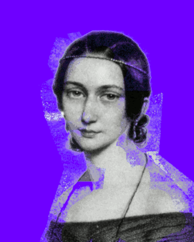

# Clara Schumann NFT on Cardano

Portraits of Clara Schumann, Lithography by Andreas Staub, 1839

[Policy ID 2e8e5e8e1d7837ccc509e30045f656f9e9ebed7ef5621085172d0e9a](https://pool.pm/policy/2e8e5e8e1d7837ccc509e30045f656f9e9ebed7ef5621085172d0e9a)

[Impressum / Legal Information](https://philipphenkel.github.io/impressum/)
